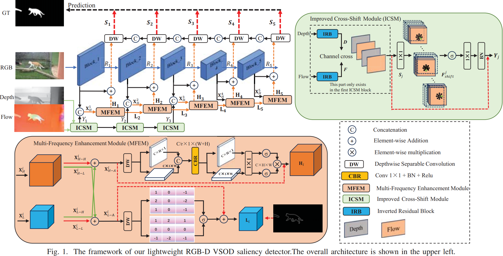
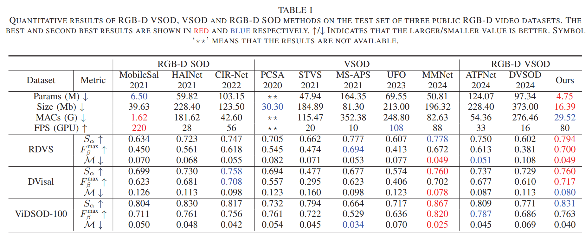

# MFENet

[ICASSP 2025: 
MFENet: Lightweight Multi-Frequency Enhancement Network for RGB-D Video Salient Object Detection](https://ieeexplore.ieee.org/stamp/stamp.jsp?tp=&arnumber=10890388)

This repository contains full training & testing code, and pretrained saliency maps. our method achieves competitive accuracy compared to nonefficient models, running at 80 FPS on a GPU with only 4.75M parameters.

If you run into any problems or feel any difficulties to run this code, do not hesitate to leave issues in this repository.

My e-mail is:  tibesonam@gmail.com

# Lightweight Multi-Frequency Enhancement Network for RGB-D Video Salient Object Detection[[PDF]](https://ieeexplore.ieee.org/stamp/stamp.jsp?tp=&arnumber=10890388)
Daerji Suolang, Jiahao He, Wangchuk Tsering, Keren Fu, Xiaofeng Li, Qijun Zhao
<p align="center">
     <br />
 <em> 
     Block diagram of MFENet.
    </em>
</p>

## The most Lightweight RGB-D VSOD method &#x26A1;
- Low model size: Model size is only **16.39Mb**.
- High accuracy: SOTA performance on 2 new RGB-D VSOD datasets (RDVS, DVisal), and second performance on new RGB-D VSOD dataset(ViDSOD-100).
- High Speed: running at 80 FPS on a Titan X Pascal GPU.
<p align="center">
     <br />
 <em> 
     QUANTITATIVE RESULTS OF MFENet.
    </em>
</p>

### Requirements

- Python 3.7
- Pytorch 1.6.0
- Torchvision 0.7.0
- Cuda 9.2
- Ubuntu16.04


### Data Preparing

Before training/testing our network, please download the training data: 

* Download the VSOD DATASETS. (containing DAVIS and DAVSOD) from [Baidu Driver](https://pan.baidu.com/s/1mVtAWJS0eC690nPXav2lwg) (PSW: 7yer).
* Download the RGB-D DATASETS. (containing NJU2K and NLPR) from [Baidu Driver](https://pan.baidu.com/s/1wI-bxarzdSrOY39UxZaomQ) [PSW: 940i].
* Download the datasets (RDVS and DVisal) from [Baidu Driver](https://pan.baidu.com/s/1vYEDy4uPbbB20Cvik-oriQ) (PSW: d4ew).

Note: if you are blocked by Google and Baidu services, you can contact me via e-mail and I will send you a copy of data and model weights.

We have processed the data well so you can use them without any preprocessing steps. 
After completion of downloading, extract the datasets and and save it at './dataset/'. 

### Train

It is very simple to train our network. We have prepared a script to run the training step:
```
python trainMobie2.py
```

### Test
1. Download the trained model from [[Google Drive]](https://drive.google.com/drive/folders/1QsDPV3cCHoIAnTjnyWl4hRQIjDhoflkW?usp=drive_link) and modify the  `model_path` to its saving path in the `test.py`.

2. Run `python test.py` in the terminal.


#### Generate Saliency Maps

After preparing the pretrained models, it is also very simple to generate saliency maps via MFENet:

```
Run `python test.py` in the terminal.
```

The scripts will automatically generate saliency maps on the `maps/` directory.


#### Speed Test
We provide a speed test script on MFENet:

```
python speed_test.py
```

### Others 

#### Citation

If you are using the code/model/data provided here in a publication, please consider citing our work:

````
@inproceedings{suolang2025lightweight,
  title={Lightweight Multi-Frequency Enhancement Network for RGB-D Video Salient Object Detection},
  author={Suolang, Daerji and He, Jiahao and Tsering, Wangchuk and Fu, Keren and Li, Xiaofeng and Zhao, Qijun},
  booktitle={ICASSP 2025-2025 IEEE International Conference on Acoustics, Speech and Signal Processing (ICASSP)},
  pages={1--5},
  year={2025},
  organization={IEEE}
}
````


#### Acknowlogdement

This repository is built under the help of the following five projects for academic use only:

* [PyTorch](https://github.com/pytorch/pytorch)

